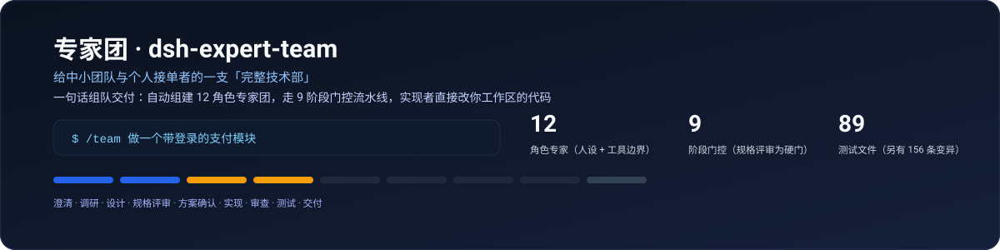
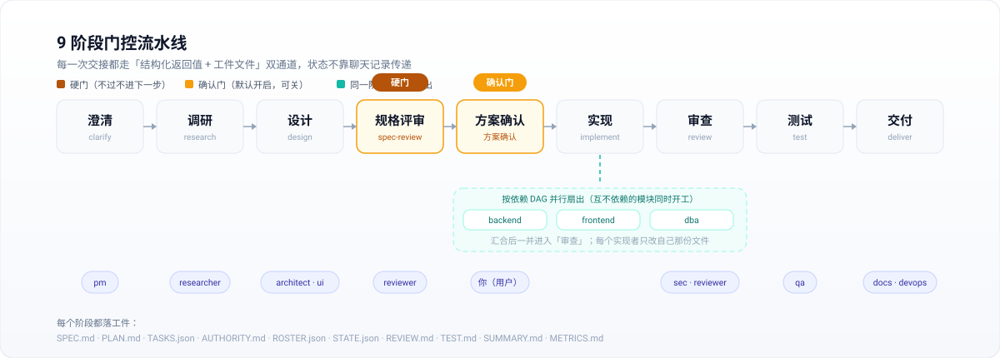
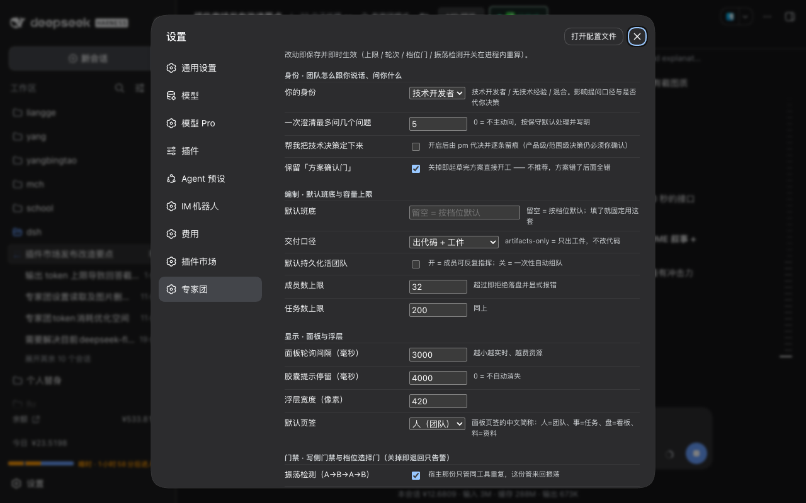

# expert-team · dsh-expert-team

English | [中文](README.md)

[](https://www.npmjs.com/package/@yangdcm/dsh-expert-team)
[](LICENSE)
[](https://github.com/yangdcm/dsh-expert-team/actions/workflows/ci.yml)



> **One sentence in, a gated team delivery out.** `/team build a payments module with login`
> assembles a 12-role expert team and runs
> clarify → research → design → spec-review → plan-approval → implement → review → test → deliver,
> with implementers editing your workspace directly and every hand-off persisted as a reviewable artifact.

A plugin for [DeepSeek Harness](https://github.com/deepseek-ai/deepseek-harness) (dsh):
**zero runtime dependencies, no build step, no install hooks.**

| 12 roles | 9 phases | 80 test files | 0 runtime deps | 0 build steps |
|---|---|---|---|---|
| own persona / `toolFilter` / `maxDepth: 1` | 1 hard gate + 1 approval gate | incl. a 136-entry mutation catalog and several ratchets | `dependencies: {}` | no bundler, no `prepare` hook |



<sub>Figure 1: the 9-phase gated pipeline. `spec-review` is a **hard gate** — if the SPEC.md
"boundaries and prohibitions" section is empty, the run does not advance (`lib/interception.js`).
`plan-approval` is an approval gate that is **on by default** (`identity.keepPlanGate`, can be turned off in settings).
The `implement` phase **fans out** along the dependency DAG: several implementers start at once, each touching only its own files.</sub>

---

## In 30 seconds

```text
$ /team build a payments module with login
  │
  ├─ clarify       pm           pins down boundaries & acceptance   → SPEC.md ("boundaries and prohibitions")
  ├─ research      researcher   evidence and options                → RESEARCH.md
  ├─ design        architect    module split, dependency DAG        → PLAN.md
  ├─ spec-review   reviewer     ▣ HARD GATE: no boundaries, no pass  ← cannot advance
  ├─ plan-approval you          ▣ approval gate (on by default)
  ├─ implement     backend …    fan out along the DAG                → edits your workspace directly
  ├─ review        sec·reviewer independent review (cross-model)     → REVIEW.md
  ├─ test          qa           repro, coverage, regressions         → TEST.md
  └─ deliver       docs         wrap-up and cost                     → SUMMARY.md · METRICS.md

  Persisted throughout: TASKS.json · ROSTER.json · STATE.json · AUTHORITY.md · RUN.log.md
  On disk at: <your workspace>/team/<run-id>/
```

<sub>This is the "phase → who works → which artifact" mapping (phase names come from the single source
`lib/vocab.js`; artifact names are taken from the shipped templates and code). To watch what it is doing
*right now*, use the overlay in `dsh web`, or `/team canvas` for the full-screen canvas.</sub>

## Why not "one agent doing it all"

A single agent doing large work fails in three predictable ways: **context drift** (long tasks wander),
**self-review** (nobody verifies independently), and **rework that never converges**. Four mechanisms
answer them:

| Mechanism | How |
|---|---|
| **Role separation** | 12 roles, each with its own persona, tool boundary (`toolFilter`) and delegation depth (`maxDepth: 1`); product/architecture roles only read and write planning artifacts, review/security are read-only, only implementers touch code |
| **Phase gates** | 9 phases; every hand-off travels two channels — a structured return value **and** an artifact file. State never rides on chat history |
| **Quality gates** | State-machine consistency is **enforced by plugin code**, not requested in a prompt: a task cannot be marked completed while unfinished, quality issues must be adjudicated by qa/reviewer, coverage gaps and over-budget rework are caught — violations show up **live** in the overlay and in `/team status` |
| **Convergence & accounting** | Every run records tokens, elapsed time, time-to-first-artifact and a closing budget; `/team learn` distills cross-run experience and feeds it back before the next run starts |

## What it looks like in action


<sub>Figure 2: **gate violations**. Look at the banner at the top — the violation and its refusal reason
(e.g. "SPEC.md's boundary section has entered `implement` but still has no 'expected rejection' row")
is decided by `lib/interception.js`, hooked onto the host's `tools/post-execute` waterfall, and surfaced
immediately. This is code, not a prompt reminder.</sub>


<sub>Figure 3: **the roster**. Look at the member list — who is running, on which model, and what it is doing;
expand a member for its tasks and artifacts. Models are configurable per role; heterogeneous models are used for cross-checking.</sub>


<sub>Figure 4: **phases and artifacts**. Look at the phase bar and the preview pane — the current phase, the phases
already passed, and the actual body of the artifact written in that phase (artifacts are the single source of truth; the overlay is just a view of them).</sub>



<sub>Figure 5: **settings**. Look at the official `Settings → Expert team` page — 18 settings, Chinese labels,
**saved on change and applied immediately** (caps, rounds, the tier gate and the oscillation detector are recomputed
in-process). Values live in the host namespace `expert-team`, so they travel with the plugin market's backup/restore.</sub>

## Why it is dependable

- **The state machine is enforced by plugin code, not requested by prompt.** `lib/interception.js` moves the
  "task-ledger contract" and the "spec boundary" rules onto the host's `tools/post-execute` waterfall:
  duplicate ids / cycles / self-dependencies are rejected on the spot (`HARD_GRAPH_CODES`), and an empty SPEC
  boundary section cannot enter `implement` (`SPEC_COMPLETE_PHASES`). **Silence in the spec means permission —
  that is the number-one source of rework.**
- **Zero runtime dependencies, zero devDependencies, no build step, no `prepare`/`postinstall` hooks.**
  What you install is exactly what runs; there is no "unknown script at install time" layer.
- **80 test files plus a 136-entry mutation catalog.** `npm run test:all` needs no `install` (it is what CI runs);
  the mutation catalog requires every mutant to be killed by at least one test — the suite is not "green",
  it is *able to catch errors*.
- **Several ratchet tests** pin down rules that were already thought through, so they cannot quietly regress:
  `vocab-consistency` (one source for vocabulary and role labels), `scan-single-source` (no fact with two homes),
  `write-bypass-ratchet` (no write path may bypass interception), `settings-consumers`
  (**every setting must have a consumer**; the allow-list is compared as a set, so it can only shrink),
  `state-perf-guard` (sub-session timing must perform **zero** log reads — a performance regression fails the suite).
- **Two kinds of zero, kept apart.** "I don't know what exists" must not look like "there is nothing":
  a failed tool-face narrowing distinguishes `no-known-names` from `nothing-to-deny`; when `/state` cannot obtain
  a timestamp it returns `hasTimestamp: false` instead of passing `0` off as a measurement.
- **Failures must be loud.** Out-of-bounds writes, artifact divergence and over-budget rework always raise an
  explicit error; nothing is truncated silently — silent failure is the most expensive bug class in this repo.
- **Performance is measured and guarded.** `/state` used to read every sub-session log in full: measured at
  7.1–9.8 s warm and 283.6 s cold (75 sub-sessions), and it blocked the whole `dsh web` event loop. 1.3.5
  replaced that with a table lookup (measured at 0.0026 ms per call, zero `readSession` calls);
  **the end-to-end post-fix number is still pending a re-measurement on a real host**.
  `state-perf-guard.test.mjs` keeps it from coming back.

## Install

**Requirements**

- `dsh web` (developed and verified on **0.1.5-rc.1**; earlier versions are untested)
- Node.js ≥ 20
- The 12 role tools (`subagent_pm` / `subagent_architect` / …) are available when the session uses the
  **"Expert team mode"** preset; otherwise the plugin falls back to the generic `subagent`
  (role personas go into the prompt) — nothing is lost except the configuration-level boundary guarantees

**Option 1: command line (recommended)**

```sh
dsh plugin --profile web add @yangdcm/dsh-expert-team
# then restart dsh web so the new bundle joins the composition
```

**Option 2: plugin market** (listing not submitted yet ⇒ it may not be searchable today)

Once listed: `dsh web` → **Settings → Plugin market** → search "expert team" → install → refresh the page.

**Option 3: from source (development / unpublished)**

```sh
cd ~/.dsh/profiles/web
# package.json: add "@yangdcm/dsh-expert-team": "file:<absolute path to this package>" to dependencies
# package.json: add "@yangdcm/dsh-expert-team" to dsh.profile.bundles
pnpm install && dsh web
```

> **The skill is not copied to disk**: on load the plugin registers the `expert-team` skill as a **runtime entry**
> in the host's skill registry (relative resources point back into the package via `resourceBase`), so nothing
> appears under `$DSH_HOME/skills/` — uninstalling leaves no residue. It only falls back to copying into
> `$DSH_HOME/skills/` when the host has no skill registry.
>
> **The "Expert team mode" preset is copied** into `$DSH_HOME/.agent-presets/` (the host exposes no runtime API
> to add a scan root), but it carries a version stamp: on upgrade the whole directory is re-laid, so it never
> silently stays behind. **The plugin lays it down at load time** — after `/team uninstall`, a restart of
> `dsh web` re-lays it automatically; no manual rescue needed.
>
> **Where settings live**: **Settings → Expert team** — a full page inside the official settings menu
> (the `settings.section` slot, `id: expert-team`, `order: 50`), sharing the same entry point and panel chrome
> as other plugins' settings. The data layer is the host namespace `expert-team` (owned by the host, travels with
> the plugin market's **backup and restore**; after a change, caps/rounds/the tier gate are recomputed
> **in-process** — no restart). The overlay's old "settings" tab was removed so the same form renders in one place.
> **Honest boundary**: `default roster` (an array of role ids) is deliberately not part of the host schema
> (unreliable to express there); the control on that page and `$DSH_HOME/expert-team/settings.json` cover it.
> When the host has no settings service, every setting falls back to that file.
>
> **The A-line switch**: "Gates → Narrow the lead's tool face" (`gates.leadToolFace`, default `on`) decides whether
> execution tools (`bash/write/edit/grep/glob`) are taken away from the lead and given to the role subagents.
> Turn it off with `config.leadToolFace` or `DSH_EXPERT_TEAM_LEAD_TOOLFACE=off`.

### After installing

1. **Restart `dsh web` once**: on load the plugin lays the "Expert team mode" preset into
   `$DSH_HOME/.agent-presets/expert-team` (version-stamped; upgrades re-lay the whole directory) —
   **you never create a preset by hand**. After the restart the preset appears in the picker and all 12 role
   subagent tools are in place (see them under `Settings → Plugins → Plugin list → Session plugins`).
2. Switch the session to "Expert team mode", then run `/team <one-sentence goal>`.
3. Change settings under **Settings → Expert team** (values live in the host namespace `expert-team`, so they
   travel with the plugin market's backup/restore).

**Troubleshooting**: if the preset is gone or occupied by an unrelated preset of the same id, **one restart of
`dsh web` heals it** (the plugin re-lays it at load); alternatively run `/team <task>` once. See the
[Troubleshooting](#troubleshooting) section for the easiest trap to fall into: **do not** use the id
`expert-team` when creating a preset.

## Quick start

```
/team build a payments module with login   # one sentence in, a one-shot team delivery out
/team --persist refactor the orders module # persistent live team: members can be re-tasked, survives sessions
/team --one-shot run a small chore         # inverse override: run once even if persistence is the default
/team --no-code review the existing API    # produce planning/review/test artifacts only, change no code
/team --code implement it                  # inverse override: touch code even if "artifacts only" is the default
/team --confirm a big redesign             # create the run but do not dispatch; click "run" in the overlay
/team uninstall                            # reclaim what this plugin laid down under $DSH_HOME
/team status                               # phase, members, model plan and live violations for every run
/team resume <run-id>                      # resume across sessions
```

Full command list (`/team canvas` visual canvas, `/team codeindex` code index, `/team learn` self-learning,
`/team limit` quotas, `/team settle` cold-start settlement, …) — see `/team help`.

**Where artifacts land**

- `<your workspace>/team/<run-id>/` — `SPEC / PLAN / TASKS / ROSTER / STATE / REVIEW / TEST / SUMMARY / RUN.log.md` etc.
- `$DSH_HOME/expert-team/` — machine-local preferences and cross-project experience: `settings.json`,
  `session-runs.json`, `LEARNINGS.md`

## Layout

```
cordis.patch.yml       the only composition contribution: a host-plane /team command line
lib/command.js         /team command: parse + create workspace + install skill + launch team + 11 overlay routes
lib/validate.js        pure-function validators for the state machine / quality gates / capacity caps
lib/interception.js    moves the ledger contract and spec boundary onto tools/post-execute (gates in code)
lib/tier.js            single source for the process-tier vocabulary
lib/vocab.js           single source for phases/roles/tiers (both host and client derive from it)
lib/metrics/           token accounting, time-to-first-artifact, closing budget, METRICS rendering
lib/routes/            shared route helpers (uniform 405/500/JSON handling, local-origin guard)
client.js              the client overlay (module-loader bundle, only require('react'))
skills/expert-team/    the orchestration "brain": SKILL.md + references/ + assets/templates/
presets/expert-team/   the "Expert team mode" preset: 12 role subagent tool instances
```

Almost all of the orchestration protocol lives in the skill rather than in code — so the team protocol can
evolve with the skill, without shipping a new package.

## Development

```sh
npm run test:all        # 80 test files, zero dependencies, no install needed (this is what CI runs)
npm run rename <name>   # after forking: syncs 4 package-name spellings across 13 files
npm run check:name      # check for leftover placeholder package names
```

`npm run gate` (`gate:preset` / `gate:sync` / `gate:evidence` / `gate:bypass` / `gate:mutation`) are
**development-machine-only** gates: `gate:sync` compares against the bootstrap copy under your local
`$DSH_HOME`, and `gate:preset` borrows the Config schema shipped with the dsh installation
(auto-detected; override with `DSH_INSTALL`). They are therefore **not run in CI**.

## Troubleshooting

**The "Expert team" page is missing from the settings menu?** Check the version (≥ 1.3.0):
`dsh plugin --profile web add @yangdcm/dsh-expert-team`, or `npm view @yangdcm/dsh-expert-team version`,
then **restart `dsh web`** — the page did not exist before 1.3.0.

**The preset shows as a bare id (`expert-team`) and the session has no role tools?** Then
`$DSH_HOME/.agent-presets/expert-team/` does not hold our copy (it was deleted, or an unrelated preset
took the id). Fix in this order:

1. run `/team <any small task>` — the plugin re-lays a version-stamped copy from the package (easiest; since 1.3.0
   it is also laid down at plugin load);
2. or copy from the package: `cp -f <package>/presets/expert-team/{agent.cordis.yml,preset.yml} ~/.dsh/.agent-presets/expert-team/`;
3. **do not** create a preset with the same id in `Settings → Agent presets` — you would only get a copy of the
   **source** you picked (e.g. standard mode), not our preset.

Then **restart `dsh web`** (the preset roster is read at startup; refreshing the page is not enough) and open a
**new session** (the preset is fixed when a session is created).

**The overlay opens slowly / `dsh web` feels sluggish?** Before 1.3.5, `/state` read every sub-session log in full
(measured 7–10 s warm, 283 s cold) and blocked the event loop. Upgrade to ≥ 1.3.5 and restart `dsh web`.

## Custom presets (when you want to change expert-team's defaults)

- **Create**: `Settings → Agent presets → create a custom preset with "Creator mode"` (the mechanism is
  "copy an existing preset"; output lands in `$DSH_HOME/.agent-presets/<id>/`).
- **To customize the expert team, copy from "Expert team mode" and pick your own id** (e.g. `my-team`):
  the copy comes with all 12 role tools and the skill directory, and your edits stay in `my-team/`.
  **Never edit files in `expert-team/`** — that copy belongs to the plugin and is re-laid on load/upgrade.
- A newly created preset may only appear in the picker **after a restart of `dsh web`** (the host reads its
  roster at startup).

## Honest boundaries

- **The local-origin guard is in place, but it is not authentication.** All 11 overlay routes validate the Host
  header (against DNS rebinding), the Origin of mutating methods (against cross-site writes) and the client
  address (against the LAN); mutating methods additionally require `application/json` (blocking form/text-plain
  "simple requests" that skip preflight). `/file` goes through the host `ctx.fs` policy and reports 403 honestly
  when a read is denied rather than **falling back to a raw read**.
  **Residual risk, stated plainly**: any local non-browser process can forge arbitrary request headers, and dsh
  plugins have no authentication model — so do not expose `dsh web` to an untrusted network (with the host
  configured as `host: 0.0.0.0`, the guard only blocks clients that are not on loopback).
- **Web profile only**: the overlay and routes depend on `webServer`; without an overlay the command and the
  artifacts still work.
- **Preset drift**: the shipped "Expert team mode" is a copy of the official `standard` preset plus the role tools;
  if the host changes its built-in preset structure, this needs a sync. Upgrades re-lay the whole directory by
  version stamp; `/team uninstall` reclaims it (a user-authored preset with the same name is never touched).
- **It intentionally runs `git status --porcelain` (read-only)** to judge artifact freshness.
- **Unwired settings are never dressed up as working.** Every setting either really takes effect or is marked
  "not yet in effect" (driven by the single source `INERT_SETTINGS`) and watched by
  `settings-consumers.test.mjs` — that table is currently empty.

## Compatibility

- `engines.dsh: >=0.1.5-rc.1`, declared in `package.json` under `dsh.compatibility` (`dshReleases` marks it
  release by release); the plugin market uses it to decide whether this plugin fits your host.
- Node.js ≥ 20.
- Profile: `web` (see "Honest boundaries" above).

## License

MIT © yangdcm
