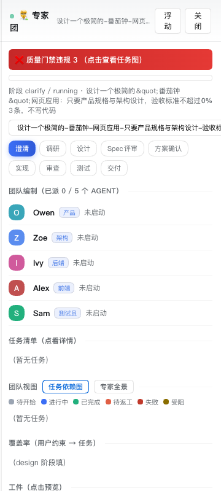
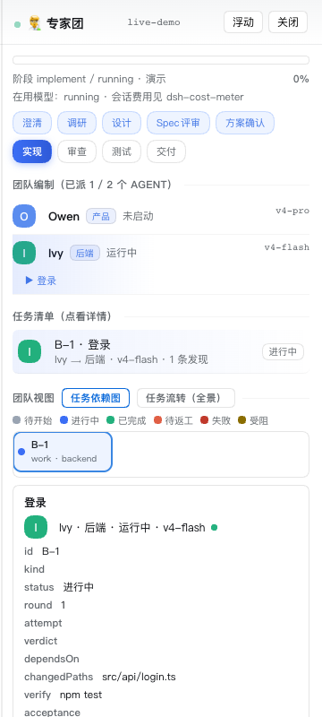
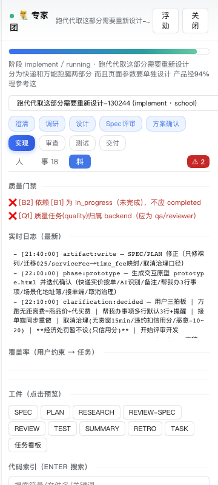

# 专家团 · dsh-expert-team

[English](README.en.md) | 中文

[](https://www.npmjs.com/package/@yangdcm/dsh-expert-team)
[](LICENSE)
[](https://github.com/yangdcm/dsh-expert-team/actions/workflows/ci.yml)

> **一句话组队交付**：`/team 做一个带登录的支付模块` —— 自动组建 12 角色专家团，走
> 澄清 → 调研 → 设计 → 规格评审 → 方案确认 → 实现 → 审查 → 测试 → 交付 的门控流水线，
> 实现者直接改你工作区的代码，全程留痕成可复核的工件。

装在 [DeepSeek Harness](https://github.com/deepseek-ai/deepseek-harness) 上的 dsh 插件，
**零运行时依赖、无构建步骤、无安装钩子**。





<sub>截图即真实浮层：门禁违规横幅、角色编制（谁在跑、用哪个模型）、任务详情与工件预览。</sub>

---

## 它解决什么

单个 agent 干大活有三个固定失败模式：**上下文漂移**（长任务越做越偏）、**自己批自己**
（没人独立验证）、**返工不收敛**（同一个问题来回改）。专家团用四件事对付它们：

| 机制 | 做法 |
|---|---|
| **角色分工** | 12 个角色各带独立人设、工具边界（`toolFilter`）、委派深度（`maxDepth: 1`）；产品/架构只读写计划工件，审查/安全只读，实现者才动代码 |
| **阶段门控** | 9 个阶段，每次交接走「结构化返回值 + 工件文件」双通道，不靠聊天记录传状态 |
| **质量门禁** | 状态机一致性由**插件代码强制**（不是提示词请求）：任务未完成不能标 completed、质量问题必须由 qa/reviewer 裁决、覆盖率缺口、超轮次返工——违规**实时**显示在浮层并计入 `/team status` |
| **收敛与记账** | 每 run 记 token/耗时/首产物时间/收尾预算；`/team learn` 跨 run 蒸馏经验并在下次开工前回注 |

## 角色与阶段

**12 角色**：产品(pm) · 架构(architect) · 调研(researcher) · 界面设计(ui) · 后端(backend) ·
前端(frontend) · 数据(dba) · 安全审计(sec) · 评审(reviewer) · 测试(qa) · 运维(devops) · 文档(docs)。
按任务复杂度裁剪：小活只起需要的角色。

**9 阶段**：`澄清 → 调研 → 设计 → 规格评审 → 方案确认 → 实现 → 审查 → 测试 → 交付`
（`/team --tier 快速档|标准档|严格档` 控制流程档位）。

## 安装

**要求**

- `dsh web`（本包在 **0.1.5-rc.1** 上开发与验证；更早版本未经测试）
- Node.js ≥ 20
- 会话使用 **「专家团模式」** preset 时，12 个角色工具（`subagent_pm` / `subagent_architect` / …）才可用；
  否则自动退回通用 `subagent`（角色人设写进 prompt），功能不丢、只是少了配置层的边界保证

**方式一：插件市场（推荐）**

`dsh web` → **设置 → 插件市场** → 搜索「专家团」→ 一键安装 → 刷新页面。

**方式二：命令行**

```sh
dsh plugin --profile web add @yangdcm/dsh-expert-team
# 然后重启 dsh web，使新 bundle 进入组合
```

**方式三：从源码（开发/未发布时）**

```sh
cd ~/.dsh/profiles/web
# package.json：dependencies 加 "@yangdcm/dsh-expert-team": "file:<本包绝对路径>"
# package.json：dsh.profile.bundles 加 "@yangdcm/dsh-expert-team"
pnpm install && dsh web
```

> 首次 `/team` 会幂等地把 `expert-team` skill 与「专家团模式」preset 自举到
> `$DSH_HOME/skills/` 与 `$DSH_HOME/.agent-presets/`。

## 快速上手

```
/team 做一个带登录的支付模块          # 一句话组队（一次性，自动组队并交付）
/team --persist 重构订单模块            # 持久化活团队：成员可反复指挥、跨会话恢复
/team --no-code 评审现有 API 设计       # 只产出计划/评审/测试工件，不改代码
/team --confirm 大改版需求              # 先建 run、不自动派工，浮层点「执行」才开工
/team status                            # 所有 run 的阶段、成员、模型计划、实时违规
/team resume <run-id>                   # 跨会话恢复
```

完整命令（`/team canvas` 可视化画布、`/team codeindex` 代码索引、`/team learn` 自学习、
`/team limit` 配额、`/team settle` 冷启动清算……）见 `/team help`。

**产物落在哪**

- `<你的工作区>/team/<run-id>/` —— `SPEC / PLAN / TASKS / ROSTER / STATE / REVIEW / TEST / SUMMARY / RUN.log.md` 等工件
- `$DSH_HOME/expert-team/` —— 本机偏好与跨项目经验：`settings.json`、`session-runs.json`、`LEARNINGS.md`

## 插件结构

```
cordis.patch.yml       唯一的组合贡献：一个 host 面的 /team 命令行
lib/command.js         /team 命令：解析 + 建工作区 + 装 skill + 触发团队 + 11 条浮层路由
lib/validate.js        状态机/质量门禁/容量上限的纯函数校验器
lib/tier.js            流程档位词表的唯一真源
lib/metrics/           token 记账、首产物耗时、收尾预算、METRICS 渲染
lib/routes/            路由层共享件（统一 405/500/JSON 处理）
client.js              客户端浮层（模块加载器 bundle，仅 require('react')）
skills/expert-team/    编排「大脑」：SKILL.md + references/ + 工件模板
presets/expert-team/   「专家团模式」preset：12 个角色 subagent 工具实例
```

编排协议几乎全在 skill 里而非代码里 —— 这样团队协议可以随 skill 更新，不必改包。

## 开发

```sh
npm run test:all        # 75 个测试文件，零依赖、无需 install（CI 跑的就是它）
npm run rename <新包名>  # fork 后改名：自动同步 13 个文件里 4 种包名写法
npm run check:name      # 检查占位包名残留
```

`npm run gate`（`gate:preset` / `gate:sync` / `gate:evidence` / `gate:bypass` / `gate:mutation`）
是**开发机专用**门禁：`gate:sync` 比对本机 `$DSH_HOME` 下的自举副本，`gate:preset` 借用本机
dsh 安装里插件自带的 Config schema（dsh 路径自动探测，可用 `DSH_INSTALL` 覆盖），因此**不在 CI 里跑**。

## 已知限制

- **本机来源守卫已就位，但不是鉴权**：11 条浮层路由现在统一校验 Host（挡 DNS rebinding）、
  写方法的 Origin（挡跨站写入）、客户端地址（挡局域网），写方法还要求 `application/json`
  （挡 form / text-plain 这类不触发预检的"简单请求"）；`/file` 改走宿主 `ctx.fs` 策略，
  读被策略拒绝时如实报 403 而**不退回裸读**。
  **残余风险如实说明**：本地非浏览器进程本来就能自造任意请求头，而 dsh 插件没有鉴权模型 ——
  所以别把 `dsh web` 暴露到不可信网络（宿主配置 `host: 0.0.0.0` 时，守卫只挡住"没有回环地址"的客户端）。
- **仅 web profile**：浮层与路由依赖 `webServer`；无浮层时命令与工件仍然可用。
- **preset 漂移**：随包的「专家团模式」是官方 `standard` preset 的拷贝 + 角色工具，
  宿主若调整内置 preset 结构，需要同步更新。
- 会调用 `git status --porcelain`（只读）用于工件新鲜度判断。

## License

MIT © yangdcm
